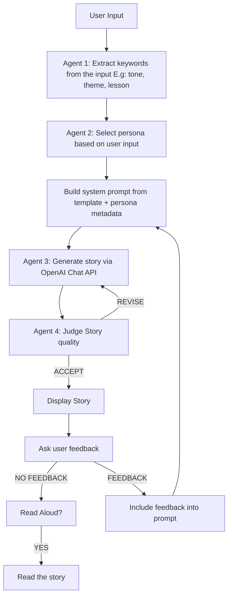

# Multi-Agent-Story-Generator

A Python-based bedtime-story generator that uses OpenAI’s Chat API + dynamic persona selection to craft engaging, age-appropriate children’s stories and even read them aloud.

---

## Table of Contents

1. Project Overview  
2. Architecture & Flow  
3. Why This Architecture?  
4. Key Components & Libraries  
5. Efficiency Highlights  
6. Prompt Design & Rationale  
7. Getting Started  
8. Customization  
9. Additional Tips  
10. Contributing & License  

---

## 📖 Project Overview

This tool lets you enter a simple prompt (e.g. “Tell me a spooky pirate tale about bravery”) and automatically:

1. **Extract** key requirements (tone, theme, lesson) via a small LLM prompt  
2. **Select** the best “persona” (e.g. StoryHippo, CaptainHippo) matched to those requirements  
3. **Build** a system prompt from templates & persona metadata  
4. **Generate** a story with OpenAI’s Chat API  
5. **Judge & Revise** the story if it fails quality checks  
6. **(Optionally) Read aloud** the final story via TTS  

---

## 🏗️ Architecture & Flow




---

## 🎯 Why This Architecture?

- **Separation of Concerns**  
  Extraction, classification, generation, and TTS are decoupled, making each step easier to test, maintain, or replace.

- **Robustness**  
  Fallbacks to default parameters if LLM parsing fails.  
  Judge/revise loop ensures high-quality, child-appropriate output without manual work.

- **Extensibility**  
  Add new personas or tweak defaults via prompt_config.json -> no code changes required.  
  Swap TTS engine (e.g., pyttsx3) for offline support.

---

## 🛠️ Key Components & Libraries

| Module            | Purpose                                          |
|-------------------|--------------------------------------------------|
| openai            | Chat API calls for all LLM-based tasks           |
| gTTS              | Online Text-to-Speech for expressive audio output |
| pyttsx3           | (Optional) Offline TTS fallback                  |
| IPython.display   | Embed audio player in notebooks or simple GUIs   |
| json, tempfile    | Config handling & secure temp file management    |

---

## ⚡ Efficiency Highlights

- **Single Config Load**  
  PromptManager bootstraps or loads prompt_config.json once at startup.

- **Deterministic Parsing**  
  Extraction & persona prompts run at temperature=0 to ensure consistency.

- **Minimal Token Wastage**  
  Only invokes the judge/revise loop when necessary.

- **Lightweight Audio**  
  Temporary MP3 files + native audio embedding—no heavy frameworks or persistent storage.

---

## 💬 Prompt Design & Rationale

1. **Extraction Prompt**  
   Purpose: Convert free-form user requests into a strict JSON schema.  
   Strengths: Clear key definitions, example I/O, “Return EXACTLY valid JSON” directive ensures reliable downstream consumption.

2. **Persona-Selection Prompt**  
   Purpose: Choose one persona key and provide a brief justification.  
   Strengths: Presents all persona options, enforces JSON output, and includes examples—minimizes parsing errors.

3. **System-Message Template**  
   Purpose: Merge persona metadata (name, tone, age range, description) with user-specified parameters.  
   Strengths: Modular, human-readable format allows easy tweaking of story length, lesson, and style.

4. **Judge Prompt**  
   Purpose: Enforce quality criteria (engagement, appropriateness, structure, moral, tone).  
   Strengths: Structured checklist + required format (“Decision: …”) makes parsing verdicts straightforward.

---

## 🚀 Getting Started

1. Clone & Install  
   ```
   git clone https://github.com/Deekshita-karingula-01/Multi-Agent-Story-Generator.git
   cd Multi-Agent-Story-Generator
   pip install -r requirements.txt
   ```

2. Set Your API Key  

3. Run  
   ```
   python main.py
   ```

4. Interact  
   - When prompted, enter your story request.  
   - Optionally specify extra parameters in the form key=value (comma-separated).

---

## 🔧 Customization

- **Add/Modify Personas**  
  Edit prompt_config.json under "personas". Each entry needs:
  ```json
  "key": {
    "name": "...",
    "tone": "...",
    "age_range": "...",
    "description": "..."
  }
  ```

- **Change Defaults**  
  Update "defaults" for fallback persona, story length, lesson, and style.

- **Adjust Templates**  
  Tweak the "system" string under "templates" to experiment with different prompt phrasing or grammar.

- **Swap TTS Engine**  
  Replace calls to gTTS with pyttsx3 in read_story_aloud() for offline support or voice variety.

---

## 🔍 Additional Tips

- **Multi-Language Support**  
  Pass lang="es" (or other supported codes) to read_story_aloud() to generate stories in different languages.

- **Tuning Judge Criteria**  
  Modify the judge prompt’s checklist if targeting other age ranges or tone (e.g., “exciting action stories” for older kids).

---
